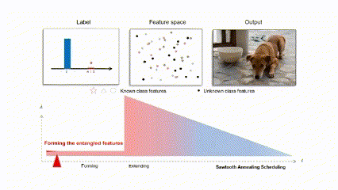

# Annealing-based-Label-Transfer-Learning-for-Open-World-Object-Detection (CVPR 2023)

## Introduction

This repository is the official PyTorch implemetation of paper "**Annealing-based-Label-Transfer-Learning-for-Open-World-Object-Detection**".


<!---
<p align="center">
  
</p>
-->

**NOTE**: 

- In the `master` branch, we applied our method to the Faster-RCNN framework, and in the `ow-detr` branch, we applied our method to the same Deformable DETR framework as ow-detr.
- If you want to learn more about the disentanglement and the visualization of our approach, please check out the [supplementary video](https://drive.google.com/file/d/1nAimggG9peKPTTCzcmALhDhyxDq8hV6z/view?usp=share_link).

## Key Code

Our key codes of the RCNN-based and DETR-based model are listed below, respectively： 

<html>
    <table style="width: 100%;">
        <tr>
            <td style="width: 50%;">
                <!--左侧内容-->
                <pre><code>
<strong>RCNN-Based</strong> 
.
└── detectron2
    ├── data
    │   └── LabelTrans_common.py
    └── modeling
        ├── meta_arch
        │   └── rcnn.py
        └── roi_heads
            └── AnneallingLT_out.py
            </code></pre>
            </td>
            <td style="width: 50%;">
                <!--右侧内容-->
                <pre><code>
<strong>DETR-Based</strong> 
.
├── configs
│   └── new1026
├── main_open_world.py
└── models
    └── AnneallingLT_detr.py
├── requirements.txt
└── scripts
                </code></pre>
            </td>
        </tr>
    </table>
</html>

- The code of RCNN-based model is built on detectron2 framework. The main structure of the model is set up in the [detectron2/modeling/meta_arch/rcnn.py](https://github.com/DIG-Beihang/ALL-OWOD/blob/master/detectron2/modeling/meta_arch/rcnn.py#L24). 

<!---
The Label-Transfer learning method can be found in the  [detectron2/data/LabelTrans_common.py](https://github.com/DIG-Beihang/ALL-OWOD/blob/master/detectron2/data/LabelTrans_common.py#L46). The Sawtooth Annealing Scheduling strategy is provided in [detectron2/modeling/roi_heads/AnnealingLT_out.py](https://github.com/DIG-Beihang/ALL-OWOD/blob/master/detectron2/modeling/roi_heads/AnneallingLT_out.py#L312)

[detectron2/modeling/roi_heads/AnnealingLT_heads.py](https://github.com/DIG-Beihang/ALL-OWOD/blob/master/detectron2/modeling/roi_heads/AnneallingLT_heads.py) and the Annealing classification loss is defined in 


- In the code of DETR-based model, both the Label-Transfer learning method and the Sawtooth Annealing Scheduling strategy are provided in [models/AnnealingLT_detr.py](https://github.com/DIG-Beihang/ALL-OWOD/blob/detr-based/models/AnneallingLT_detr.py).

-->

- In the forming stage, we set the cfg.OWOD.COOLING = False to place the disentanglement degree $\lambda = 0$ and form entangled known proposals. In the extending stage, we simply set the cfg.OWOD.COOLING = True to begin the collaborative learning of known and unknown classes.

<!---
- First, modify the annotation of the data, we give all data an additional unknown class label, the code can be found [here](https://github.com/DIG-Beihang/Annealing-based-Label-Transfer-Learning-for-Open-World-Object-Detection/blob/ade50266435d699ece227192e08a46c26d57784f/detectron2/data/LabelTrans_common.py#L52)
```
if self._map_func.is_train:
  data['instances'].ori_classes = data['instances'].gt_classes.clone()
  data['instances'].gt_classes[:] = 80
```
- Second, during the extending phase of the training, which is controlled by the cfg.OWOD.COOLING parameter, we need to freeze all parameters except for the classifier, and the specific code is [here](https://github.com/DIG-Beihang/ALL-OWOD/blob/c8bfcc8074407370184a48af58e20cdb22aa1aac/detectron2/engine/defaults.py#L285). Note that the optimizer in Detectron2 is initialized after this step, and during initialization, it ignores the parameters that do not have gradients.
```
if cfg.OWOD.COOLING:
  for name, param in model.named_parameters():
    if 'cls_score' not in name:
      param.requires_grad = False
```
- Finally, after calling the new loss function, you can start the training! Code can be found [here](https://github.com/DIG-Beihang/ALL-OWOD/blob/c8bfcc8074407370184a48af58e20cdb22aa1aac/detectron2/modeling/roi_heads/AnneallingLT_out.py#L334).
```
def mixup_loss(self):
  if self._no_instances:
    return 0.0 * self.pred_class_logits.sum()
  else:
    self._log_accuracy()
    self.pred_class_logits[:, self.invalid_class_range] = -10e10
    storage = get_event_storage()
    if self.cooling:
        lam = max(self.peak - (storage.iter / self.cool_iter), 0)
    else:
        lam = 0
    loss_pred = \
        (1-lam) * F.cross_entropy(self.pred_class_logits, self.ori_classes, reduction="mean", weight=self.weights) + \
        lam*F.cross_entropy(self.pred_class_logits, self.gt_classes, reduction="mean", weight=self.weights)
    return loss_pred
```
-->

## Install for RCNN-Based
### Requirements
<!--- - Install detectron2, please refer to [INSTALL.md](./INSTALL.md). -->
- python 3.7, cuda 10.2, torch1.10.1
- pip install -r requirements.txt
- pip install -e .
### Data Preparation for ORE split
- You can download the data sets from [here](https://drive.google.com/drive/folders/1S5L-YmIiFMAKTs6nHMorB0Osz5iWI31k) and follow these steps to configure the path.
- Create folder datasets/VOC2007
- Put Annotations and JPEGImages inside datasets/VOC2007
- Create folder datasets/VOC2007/ImageSets/Main
- Put the content of datasets/OWOD_imagesets inside datasets/VOC2007/ImageSets/Main

## Install for DETR-Based
### Requirements
We have trained and tested our models on `Ubuntu 16.0`, `CUDA 10.2`, `GCC 5.4`, `Python 3.7`

```bash
conda create -n owdetr python=3.7
conda activate owdetr
conda install pytorch==1.8.0 torchvision==0.9.0 torchaudio==0.8.0 cudatoolkit=11.1 -c pytorch
pip install -r requirements.txt
```
### Compiling CUDA operators
```bash
cd ./models/ops
sh ./make.sh
# unit test (should see all checking is True)
python test.py
```
### Data Preparation for ORE split
- You can download the data set from [here](https://drive.google.com/drive/folders/1S5L-YmIiFMAKTs6nHMorB0Osz5iWI31k) and follow these steps to configure the path.
The files should be organized in the following structure:
```
OW-DETR/
└── data/
    └── VOC2007/
        └── OWOD/
        	├── JPEGImages
        	├── ImageSets
        	└── Annotations
```

## Pretrained weights
You can download the pre-trained backbone network models and the best OWOD models trained by ours methods for Task t1-t4 [here](https://drive.google.com/drive/folders/1baulMVqFWN-Vg_rVKJkkY3t_yAHtuhkJ?usp=sharing).

## Usage
### Training
- Download the pre-trained backbone network model. `R-50.pkl` is for faster rcnn framwork and `dino_resnet50_pretrain.pth` is for ow-detr framwork.
- Set the path of the pretrained model in the configs.
- You can run `train_*.sh` in the `scripts` folder by stages, Where `_t*_ `represents t1-t4 tasks. Scripts without endings (e.g. train_t2.sh) represent the increment process of forming stage. Scripts with `ft` endings (e.g. train_t2_ft.sh) represent the fine-tuning process of forming stage, and scripts with `_extending` endings  (e.g. train_t2_extending.sh) represent the extending stage. (Task t1 does not need to be fine-tuned because it has no previously known classes.) 
- You should run in order such as:
```
bash train_t2.sh
bash train_t2_ft.sh
bash train_t2_extending.sh
```


### Evaluation
- You can sample run `test_*.sh` in `scripts` folder.

## Citation

If this work helps your research, please consider citing:

```
@inproceedings{ma2021annealing,
    title={Annealing-based Label-Transfer Learning for Open World Object Detection}, 
    author={Ma, Yuqing and Li, Hainan and Zhang, Zhange and Guo, Jinyang and 
    Zhang, Shanghang and Gong, Ruihao and Liu, Xianglong},
    booktitle={CVPR},
    year={2023}
}
```

